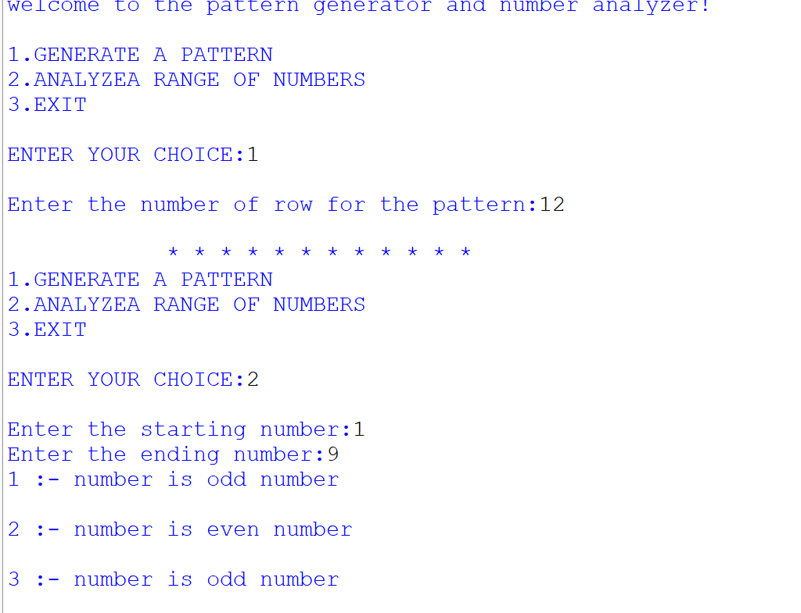
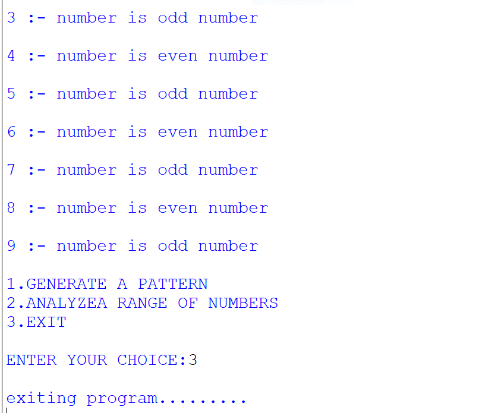

# 🎨 Pattern Generator & Number Analyzer

<div align="center">

# ✨ Welcome to the Pattern Generator and Number Analyzer ✨

A beginner-friendly Python console application that can:

⭐ Generate beautiful star patterns  
🔢 Analyze a range of numbers  
⚡ Identify Odd and Even numbers instantly  
🖥️ Interactive menu-driven interface

</div>

---

## 🚀 Features

### 🌟 Pattern Generator
Generate a pyramid-style star pattern based on the number of rows entered by the user.

Example:

```text
*
* *
* * *
* * * *
``

### 🔍 Number Range Analyzer
Analyze numbers within a selected range and determine whether each number is:

- ✅ Even Number
- ✅ Odd Number

Example:

```text
1 :- number is odd number
2 :- number is even number
3 :- number is odd number
``

---

## 🛠️ Technologies Used

- 🐍 Python
- 🎯 Match-Case Statements
- 🔁 Loops
- 📥 User Input Handling

---

## 📂 Project Structure

```text
Pattern-Generator-And-Number-Analyzer/
│
├── README.md
├── pr 2 (2).PY
├── 10.png
└── 11.png
```

---

## 📸 Project Screenshots

### Main Menu & Pattern Generation



### Number Range Analysis & Exit



---

## ▶️ How to Run

1. Install Python 3.x
2. Download the project files
3. Open terminal or command prompt
4. Run:

```bash
python "pr 2 (2).PY"
```

---

## 📋 Sample Menu

```text
1. GENERATE A PATTERN
2. ANALYZE A RANGE OF NUMBERS
3. EXIT
```

---

## 🎯 Learning Concepts

This project helps beginners understand:

- Loops (`for` loops)
- Conditional Statements
- Match-Case Structure
- User Input
- Pattern Printing
- Number Analysis

---

## 🌈 Future Improvements

- Add Number Statistics
- Prime Number Checker
- Armstrong Number Detection
- Multiple Pattern Designs
- Better UI Formatting

---

<div align="center">

### ⭐ If you like this project, give it a star! ⭐

Made with ❤️ using Python

</div>
